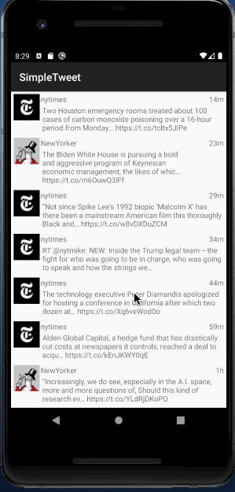
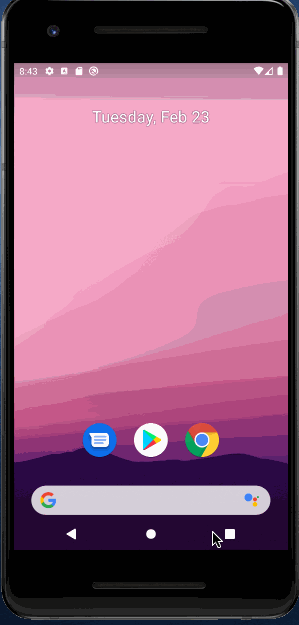
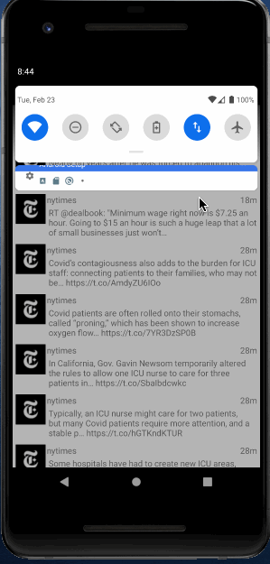

# Project 2 - *Simple Tweet*

**Simple Tweet** is an android app that allows a user to view his Twitter timeline. The app utilizes [Twitter REST API](https://dev.twitter.com/rest/public).

Time spent: **5** hours spent in total

## Part 1 User Stories

The following **required** functionality is completed:

- [x] User can **sign in to Twitter** using OAuth login
- [x]	User can **view tweets from their home timeline**
  - [x] User is displayed the tweet body along with the author's username and name
  - [x] User is displayed the [relative timestamp](https://gist.github.com/nesquena/f786232f5ef72f6e10a7) for each tweet "8m", "7h"
- [x] User can refresh tweets timeline by pulling down to refresh

The following **optional** features are implemented:

- [x] User can view more tweets as they scroll with infinite pagination

## Video Walkthrough

Here's a walkthrough of implemented user stories:

GIF created with [LiceCap](http://www.cockos.com/licecap/).

## Notes: Part 1

Part 1 of the project was challenging but enjoyable. Even though I struggled with Glide implementation in the build gradle file, I was able to work through with the help of available resources

## Part 2 User Stories

Time spent: **2** hours spent in total

The following **required** functionality is completed:

- [x] User can **compose and post a new tweet**
  - [x] User can click a “Compose” icon in the Action Bar on the top right
  - [x] User can then enter a new tweet and post this to twitter
  - [x] User is taken back to home timeline with **new tweet visible** in timeline
  - [x] Newly created tweet should be manually inserted into the timeline and not rely on a full refresh
  - [x] User can **see a counter with total number of characters left for tweet** on compose tweet page

The following **optional** features are implemented:

- [x] Use Parcelable instead of Serializable using the popular [Parceler library](http://guides.codepath.org/android/Using-Parceler).
- [x] User can **open the twitter app offline and see last loaded tweets**. Persisted in SQLite tweets are refreshed on every application launch. While "live data" is displayed when app can get it from Twitter API, it is also saved for use in offline mode.

## Video Walkthrough

Here's a walkthrough of implemented user stories:

GIF created with [LiceCap](http://www.cockos.com/licecap/).

## Notes

Part 2 was straight forward and easier to complete when compared to part 1.

## Open-source libraries used

- [Android Async HTTP](https://github.com/codepath/CPAsyncHttpClient) - Simple asynchronous HTTP requests with JSON parsing
- [Glide](https://github.com/bumptech/glide) - Image loading and caching library for Android

## License

    Copyright [2021] [Venkata Sunkara]

    Licensed under the Apache License, Version 2.0 (the "License");
    you may not use this file except in compliance with the License.
    You may obtain a copy of the License at

        http://www.apache.org/licenses/LICENSE-2.0

    Unless required by applicable law or agreed to in writing, software
    distributed under the License is distributed on an "AS IS" BASIS,
    WITHOUT WARRANTIES OR CONDITIONS OF ANY KIND, either express or implied.
    See the License for the specific language governing permissions and
    limitations under the License.
